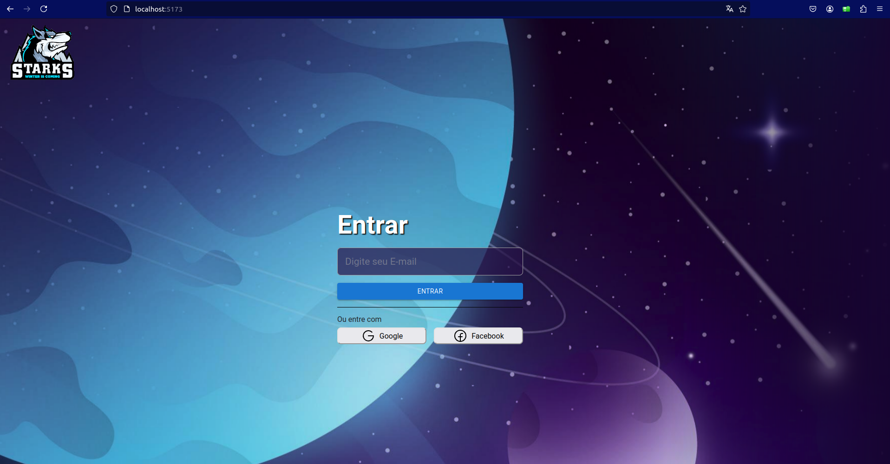
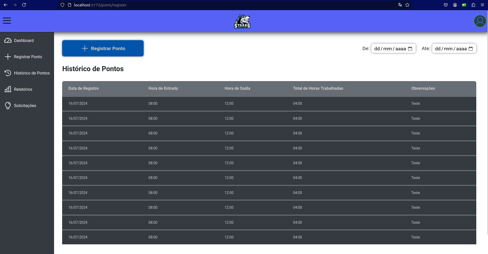
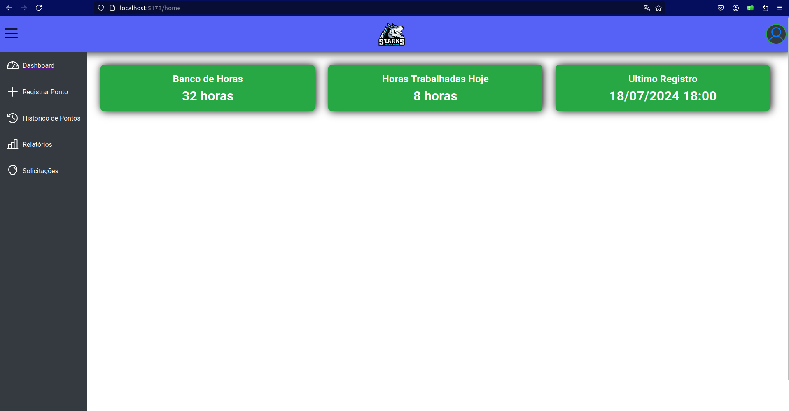

# Sistema de Registro de Pontos

Este projeto é um sistema de registro de pontos que permite aos funcionários registrar suas entradas e saídas da empresa. O intuito do projeto é a prática e o portfólio, e não possui fins comerciais.

## Funcionalidades

### **Screenshots no final do Readme** ### 

- **Tela de Login**: Autenticação de usuários para acesso ao sistema.
- **Layout Default**: Layout padrão para todas as páginas.
- **Tela de Registrar Ponto**: Interface para os funcionários registrarem suas entradas e saídas.
- **Dashboard**: Painel de controle para visualização dos registros e outras informações relevantes.

### Observações
Atualmente, apenas o front-end está implementado. As funcionalidades de autenticação, cadastro de usuários e registro de pontos ainda não estão operacionais, pois o back-end está em desenvolvimento.

## Tecnologias Utilizadas

- **TypeScript**: Utilizado para tipagem estática, proporcionando maior segurança e previsibilidade no desenvolvimento.
- **ReactJS**: Biblioteca para construção da interface do usuário, permitindo a criação de componentes reutilizáveis e a gestão eficiente do estado da aplicação.

## Como Executar o Projeto

1. **Clone o repositório**:
   ```bash
   git clone https://github.com/RicardoCassio/MiraPonto.git

2. **instale as dependências:**:
   ```bash
   cd MiraPonto
   npm install

3. **instale as dependências:**:
   npm run dev

4. **Acesse o projeto:**
   Abra seu navegador e vá para http://localhost:3000

## Screenshots ##
- **Tela de Login**: Autenticação de usuários para acesso ao sistema.
  
  
  
- **Tela de Registrar Ponto**: Interface para os funcionários registrarem suas entradas e saídas.
  
  
- **Dashboard**: Painel de controle para visualização dos registros e outras informações relevantes.
  

## Contribuições ##

Contribuições são bem-vindas! Se você tiver sugestões ou encontrar problemas, por favor, abra uma issue ou envie um pull request.
